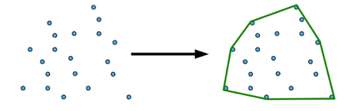

# Polydiv  

## Clipping html element in random polygon  


### Explanation:  
This module generate random number of random 2d coordinate,  
finding and keeping convex hull  
then use it for add css "clip-path" rules  



### Demo:

[Here](https://radiium.github.io/polydiv/ =250x)


### Usage:

1 - In html
```html
<!-- Create structure -->
<div>
    <div class="item">1</div>
    <div class="item">2</div>
    <div class="item">3</div>
    ...
</div>

<!-- Import Polydiv -->
<script type="text/javascript" src="./polydiv.min.js"></script>
```

2 - In javascript
```javascript
// Init Polydiv
var polydivInstance = new Polydiv({ itemClass: 'item'});

// Clip items 
polydivInstance.clipItems(function(err) {
    // All items are clipped
});

// Unclip items
polydivInstance.unClipItems(function(err) {
    // All items are unclipped
});
```

### Development:

```bash
# Install deps
npm install

# Uglify and minify
npm run dist
```


https://developer.mozilla.org/fr/docs/Web/CSS/clip-path  
Algo see: https://www.nayuki.io/page/convex-hull-algorithm<br/>
